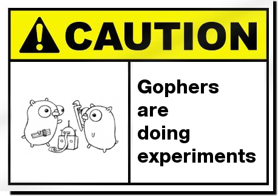

# problem

[](https://github.com/FollowTheProcess/problem)
[](https://pkg.go.dev/go.followtheprocess.codes/problem)
[](https://goreportcard.com/report/github.com/FollowTheProcess/problem)
[](https://github.com/FollowTheProcess/problem)
[](https://github.com/FollowTheProcess/problem/actions?query=workflow%3ACI)
[](https://codecov.io/gh/FollowTheProcess/problem)

[RFC-7807] Problem JSON structure in Go

> [!WARNING]
> **problem is in early development and is not yet ready for use**



## Project Description

## Installation

```shell
go get go.followtheprocess.codes/problem@latest
```

## Quickstart

### Credits

This package was created with [copier] and the [FollowTheProcess/go-template] project template.

[copier]: https://copier.readthedocs.io/en/stable/
[FollowTheProcess/go-template]: https://github.com/FollowTheProcess/go-template
[RFC-7807]: https://datatracker.ietf.org/doc/html/rfc7807
